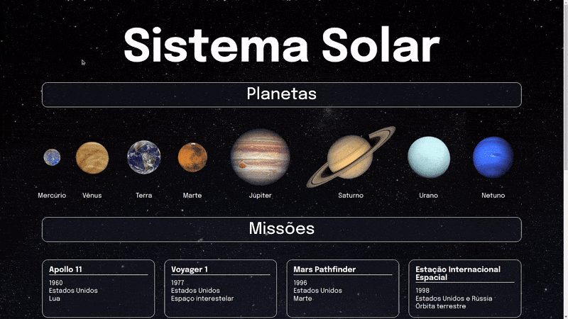

## Solar System Project

[Deploy link](https://solarsystem-erik.netlify.app/)

## About
&nbsp;&nbsp; This project is my first React application! It shows the planets on the Solar System and all the missions related to them. My goal was to develop a page based on Requirements given by [Trybe](https://www.betrybe.com/).
	
## Requirements Overview:
- [x] Create components;
- [x] Render them on screen;

## Files:
&nbsp;&nbsp; Files developed by me:
- all files inside the src/components folder;
- App.css;
- App.js;

All the other files where developed by Trybe, some of them with minor adjustments made by me.

## Technologies:
All technologies applied by me on this project:
- React
- Javascript;
- CSS;
- HTML;

## How to run the project:
- Access [https://solarsystem-erik.netlify.app/](https://solarsystem-erik.netlify.app/)
- Or git clone the repository;
- Navigate to the folder and install the dependencies with `npm install`;
- Done! Now you can start the application with `npm start`!
